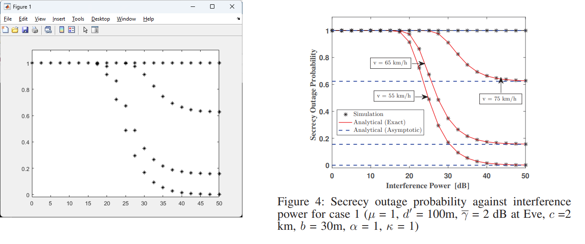

# Repository of Code for Physical Layer Security
The simulation is a reproduction of results I modelled from a tutorial paper looking at the secrecy problem for relay systems in the Physical Layer Security domain. I obtained the Signal to Noise Ratio over fading channel in a vehicular network. I derived a closed form expression for the outage probability and secrecy outage probability utilizing the amplify and forward relay protocol.

 

The image above shows a plot of my simulation results (left) compared to the paper results (right).
